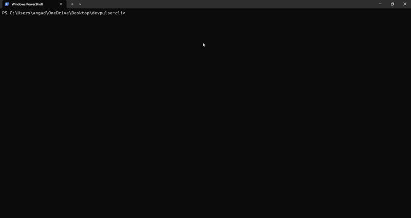

# 🚀 DevPulse CLI


DevPulse is an AI-powered command-line interface (CLI) tool designed to supercharge developer productivity. By leveraging Google's Gemini AI, DevPulse automates writing Git commits, performing code reviews, and generating Markdown changelogs—all directly from your terminal.

---

## ✨ Features

- **🤖 Smart Commits:** Analyzes your staged Git changes and generates a highly context-aware, interactive list of commit messages to choose from.
- **🧐 Automated Code Review:** Scans your latest commits and provides an instant, actionable code review highlighting good practices and potential bugs.
- **📜 Changelog Generation:** Reads your Git history and automatically compiles a clean, beautifully formatted `CHANGELOG.md` file.
- **⚙️ Model Flexibility:** Dynamically swap out the underlying AI engine to any supported Gemini model using environment variables.

---

## 📦 Installation

You can install DevPulse globally on your machine using npm:

```bash
npm install -g devpulse-cli-angad

```

---

## ⚙️ Configuration

DevPulse requires a Google Gemini API key to run. You can get one for free from the [Google AI Studio](https://aistudio.google.com/).

### 1. Required: API Key Setup

Set your API key as an environment variable in your terminal before running commands:

**Windows (PowerShell):**

```powershell
$env:GEMINI_API_KEY="your-api-key-here"

```

**Mac/Linux:**

```bash
export GEMINI_API_KEY="your-api-key-here"

```

### 2. Optional: Custom Model Selection

By default, DevPulse uses `gemini-2.5-flash` for blazing-fast performance. If you want to use a different model (like `gemini-2.5-pro` for deep code analysis), set the `GEMINI_MODEL` environment variable:

**Windows (PowerShell):**

```powershell
$env:GEMINI_MODEL="gemini-2.5-pro"

```

**Mac/Linux:**

```bash
export GEMINI_MODEL="gemini-2.5-pro"

```

---

## 💻 Usage

Once installed globally, you can run DevPulse from any Git repository on your machine using the `devpulse` command.

### 1. Write a Commit

Stage your files (`git add .`) and run:

```bash
devpulse commit

```

_The AI will read your diff, generate multiple professional commit messages, and let you select the best one via an interactive menu._

### 2. Review Code

After making a commit, run:

```bash
devpulse review

```

_The AI will review your most recent commit and print out feedback, architectural suggestions, and bug warnings._

### 3. Generate a Changelog

To generate a professional Markdown changelog from your recent history, run:

```bash
devpulse changelog

```

_This instantly creates or updates a `CHANGELOG.md` file in your root directory based on your last 10 commits._

---

## 🛠️ Tech Stack

- **Language:** TypeScript / Node.js
- **AI Integration:** `@google/genai` (Supports dynamic model shifting)
- **CLI Framework:** `commander`
- **Interactive Prompts:** `inquirer`
- **Package Manager:** npm

---

## 🧠 Knowledge Gains & Development Journey

Building this tool was an incredible journey into bridging the gap between artificial intelligence and local developer environments. Key takeaways include:

- **CLI Architecture:** Mastered building global executable commands using Node.js, `commander`, and updating local system environments.
- **LLM Integration:** Learned how to effectively prompt and integrate Google's Gemini API directly into programmatic logic, rather than just web interfaces.
- **Process Execution:** Gained deep experience using Node's `child_process` (`execSync`) to seamlessly control Git operations entirely through code.
- **Registry Publishing:** Successfully navigated compiling TypeScript to JavaScript and publishing production-ready packages to the global npm registry (including bypassing 2FA security protocols).
- **Git Internals:** Mastered staging nuances, memory clearing (`git rm -r --cached`), and correctly configuring `.gitignore` safely in live projects.

  
